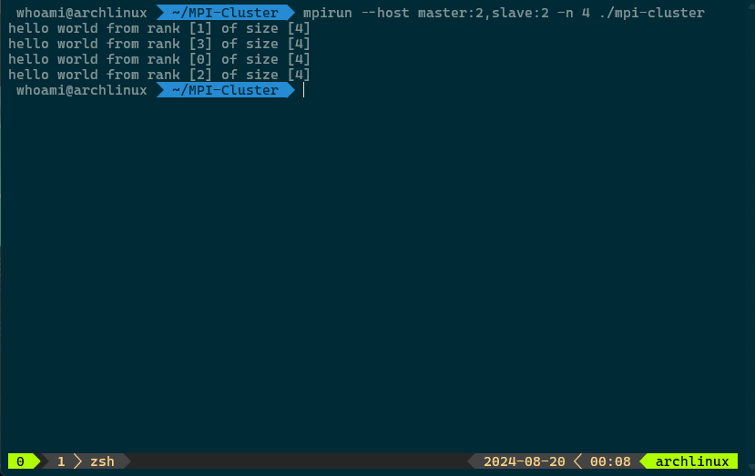

### ⚙️ Required Libraries and Tools
Ensure that MPI and SSH are installed and configured on each node. Follow these steps:

#### Install MPI on Each Node

**Download and Install OpenMPI:**
```bash
curl -OL https://download.open-mpi.org/release/open-mpi/v5.0/openmpi-5.0.5.tar.gz
tar -xzf openmpi-5.0.5.tar.gz
cd openmpi-5.0.5
./configure --prefix=$HOME/.openmpi --disable-mpi-fortran
make
sudo make install
```

#### Install SSH on Each Node
- For Arch Linux:
```bash
sudo pacman -Syu openssh
```

- For Ubuntu:
```bash
sudo apt-get openssh-server
```

- For CentOS:
```bash
sudo yum install openssh-server
```

Enable and start the SSH service:
```bash
sudo systemctl enable sshd
sudo systemctl start sshd
```

#### 🛠️ SSH Configuration
**Add Slave Node to the Master Host File**
Add the ip address of the slave to the master `/etc/hosts` file. Open the file with an editor.
```bash
sudo vim /etc/hosts
```
Add an entry for the master and slave nodes.
```
<master-ip> slave
<slave-ip> slave
```

**Generate SSH Key Pair**
Create an SSH key pair on the master node for passwordless.
```bash
ssh-keygen -t rsa -b 4096
```

**Copy SSH Key to Slave Node**
Copied to the each nodes.
```bash
ssh-copy-id your-username@master
ssh-copy-id your-username@slave
```

**Verify SSH Access**
Ensure that you can login to both the master and slave nodes without password.
```bash
ssh your-username@master
ssh your-username@slave
```

---
### 🖥️ Setup Master Computer
#### 📂 NFS-Server Configuration
**Create Export Directory**
Create a directory that you want to share with the slave nodes.
```bash
mkdir -p /path/to/share
```

**Edit Export Configuration**
Open the NFS Exports configuration file and add the directory you want to share.
```bash
sudo vim /etc/exports
```
Add the following line to share the directory with the slave node.
```
/path/to/share *(rw,sync,no_subtree_check)
```

**Export the Shared Directory**
Apply the changes to the NFS exports.
```bash
sudo exports -a
```

**Start and Enable NFS-Server**
```bash
sudo systemctl enable nfs-server
sudo systemctl start nfs-server
```

**Verify NFS-Server**
Check the status of the NFS server to ensure it is running correctly:
```bash
sudo systemctl status nfs-server
```

---
### 🖥️ Setup Slave Computer
#### 📃 Installing and Setup NFS-Client
* For Arch Linux:
```bash
sudo pacman -Sy nfs-utils
```

- For Ubuntu:
```bash
sudo apt-get install nfs-common
```

- For CentOS:
```bash
sudo yum install nfs-utils
```
#### 📂 NFS-Client Configuration
**Create Mount Point (on the slave nodes)**
```bash
mkdir -p /client-path/to/share
```

**Mount NFS Share (assuming the NFS server is the master node)**
```bash
sudo mount master:/server-path/to/share /client-path/to/share
```

**Verify the Mount**
```bash
df -h | grep "/server-path/to/share"
```

## 📌 Testing
After configuring the NFS server and client, verify that the NFS setup and MPI configuration work correctly.

#### Compile MPI Code
First ensure that your MPI code can be compiled corrently. Use `make` if you have a `Makefile` of compile manually with `mpicc`

**Using Makefile**
```bash
make mpicc
```
**Manually with `mpicc`**
```bash
mpicc -g -Wall -std=c17 main.c -o mpi-cluster
```
Replace `main.c` with your source file and `mpi-cluster` with your desired output binary name.

#### Run MPI Job
After compilling, run an MPI job to test the setup across the cluster.
Use `mpirun` to execute the MPI program on the master node, specifying the host file that lists the nodes in your cluster.

**Using Makefile**
```bash
make mpirun
```
**Manually with `mpirun`**
```bash
mpirun --host master:2,slave:2 -n 4 ./mpi-cluster
```

## 🎉 TADA IT IS WORKING!

